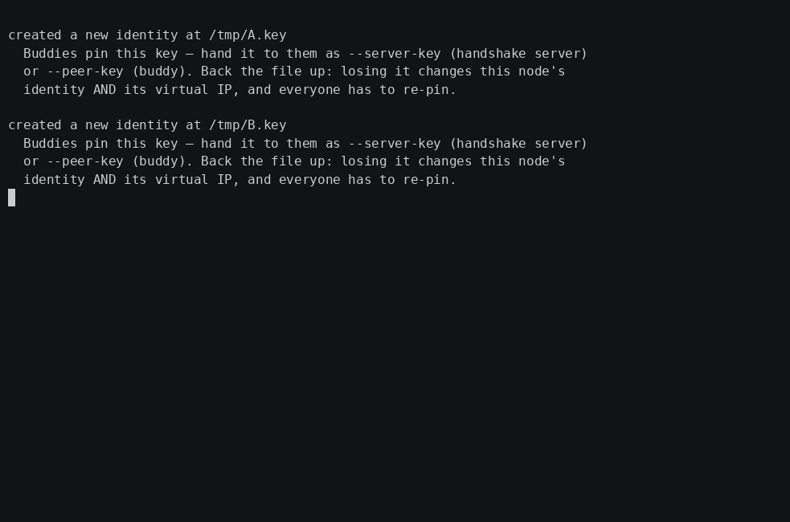

# BuddyNet

[](https://github.com/TZERO78/buddynet/actions/workflows/ci.yml)
[](go.mod)
[](https://github.com/TZERO78/buddynet/releases)
[](LICENSE)
[](lab/pentest/README.md)

> **BuddyNet is a small, self-hosted, open-source peer-to-peer network for
> families, friends, and small teams.** One binary, your own coordination
> server, direct encrypted tunnels between the machines, and an authorized
> blind-relay fallback when a direct path cannot be established. It reduces
> dependence on a managed VPN provider — it does not attempt to replace the
> administration, support, platform coverage, or enterprise features of
> Tailscale or NetBird.



<sup>Stand it up in three steps, live: the VPS runs the coordinator (`--role=handshake,relay`), machine A mints a one-time invite, machine B joins behind its own NAT, and the tunnel is `via="direct P2P"` — hole-punched, no port-forwarding, no relay in the path. Reproduce: `lab/demo-deploy.sh`.</sup>

BuddyNet gives every node a stable identity and a deterministic virtual IP, finds
peers through a small **handshake server** (the coordination server: it
introduces two machines to each other and then steps out of the way), and brings
up a direct (hole-punched)
encrypted tunnel — falling back to a blind relay only when a direct path is
impossible. Point `rsync`, `borg`, or `ssh` at a local socket and the traffic
travels to your buddy — and a single node can hold **several tunnels at once**
([MultiPeer](docs/PEERS.md)), routing to each buddy by name. The coordination
server runs on a machine *you* own. It never sees plaintext: on a direct path it
carries no tunnel data at all, and when a direct path cannot be punched it
forwards encrypted packets it cannot read.

**What "self-hosted" means here**, precisely, because the word gets stretched:

- you run the coordination server yourself, and you hold its key;
- no account with a VPN provider is involved, and no third party can see or
  manage your network;
- you decide who joins, who is revoked, and when to update.

It does **not** mean independent of an operating system, of Go, QUIC or
WireGuard, of a machine with a public address, or of an internet connection —
BuddyNet needs all of those, and it has a small set of pinned third-party
dependencies (see [CREDITS.md](CREDITS.md)).

```
buddynet --role=buddy       # ordinary peer; NAT is fine
buddynet --role=relay       # public IP; blindly forwards encrypted sessions
buddynet --role=handshake   # handshake server: coordinates pairing, carries no traffic
```

There is **no auto-detection** — you always set `--role`. Every binary carries
all three roles; in a buddy the relay and handshake code sit dormant as fallback.

## Where BuddyNet fits

Tailscale, NetBird and plain WireGuard are mature projects solving a larger
problem, and each of them does things BuddyNet does not. This is not a
comparison of who is better or more secure — it is a description of what
BuddyNet is, so you can tell whether it fits your case.

| | BuddyNet |
|---|---|
| Coordination server | one you run yourself, on a machine you own |
| Provider account | none — there is no BuddyNet service to sign up for |
| Plaintext seen by the coordination server | none, on any path |
| NAT traversal | automatic hole punching, no port forwarding |
| Relay | only your own, only as a fallback, and only for sessions your own server authorised |
| Recommended size | roughly **2 to 16 buddies** per node |
| Enforced ceiling | **48 peers**, fail-closed — a guardrail, not a target |
| Platforms | Linux (amd64/arm64) and Unraid today |
| Support | none. MIT-licensed, no SLA, no support contract, no paid tier |
| Fleet administration | none — no dashboard, no central policy, no device inventory |

> **BuddyNet is not a mesh-management platform and does not try to become one.**
> If you need large fleets, centralized policy, guaranteed relay availability,
> broad platform coverage (Windows, macOS, iOS, Android) or commercial support,
> use a platform built for that. If you want a transparent overlay between a
> handful of machines belonging to people who know each other, that is exactly
> what this is.

### What BuddyNet deliberately does not have

The small scope is a design choice, not a gap on a roadmap:

- **No enterprise identity platform.** No SSO, no directory integration, no
  org-wide policy engine — identity is one Ed25519 key per node, pinned by hand
  or through an invite.
- **No global relay network.** There is no fleet of relay servers behind
  BuddyNet. The only relay in your setup is the one you started.
- **No fleet management.** No dashboard, no central inventory, no push of
  configuration to hundreds of devices.
- **No availability guarantee.** No SLA, no support contract, no paid tier.
- **No file-sharing or backup feature.** BuddyNet moves bytes between two
  machines. Whatever you run over that connection — rsync, borg, SMB, ssh — is
  ordinary software you install, configure and secure yourself.
- **The operator owns and maintains the coordination server.** Patching,
  backups, the key file, uptime and firewalling are your job. Nobody does it for
  you — and nobody else can reach into it either.

BuddyNet is tested for small networks — a handful of machines between people who
know each other — not for hundreds or thousands of devices.

## What you need

BuddyNet needs **one publicly reachable node** to do the matchmaking (the
`handshake` role) and to act as a blind `relay` when a direct P2P path can't be
punched. That node needs a **stable, public IP address** — IPv4, IPv6, or both —
so the buddies can always find it.

You have two ways to provide it:

- **A small VPS** with a fixed public IP. The usual setup: run
  `--role=handshake,relay` on a cheap VPS *you* own. It coordinates, and when a
  direct path fails it relays ciphertext — it never sees plaintext. This is the
  [Quickstart](#quickstart-two-sites-one-vps) below; for a full step-by-step
  walkthrough (install, hardened firewall, systemd, maintenance) see
  **[docs/VPS-HOWTO.md](docs/VPS-HOWTO.md)**.
- **Your own connection, if it has a fixed public IP** (no CGNAT). Then you don't
  need a VPS at all — the machine on that line takes the `handshake` and `relay`
  roles itself, and your other buddies connect to it.

The **buddies** themselves can sit behind ordinary NAT — that's the whole point.
Only the coordinating node needs to be reachable. If your line is behind
**CGNAT** or only has a dynamic address, a VPS is the simpler option. (Dynamic
public IPs can work with a DNS name that tracks the address, but that's on you to
keep current.)

## Quickstart (two sites, one VPS)

**1 — On the VPS,** create the server identity once, then run the bootstrap
server:

```bash
# Once: create the identity and note the key your buddies will pin.
buddynet --role=handshake --key /var/lib/buddynet/id.key init   # → SERVER_KEY

# Once: mint the relay id (not a secret; the same value on both roles).
buddynet gen-relay-id                                           # → RELAY_ID

# Then run it (a server never creates its own key — see below):
buddynet --role=handshake,relay \
    --key /var/lib/buddynet/id.key \
    --relay-endpoint vps.example:51821 \
    --relay-id RELAY_ID
```

> **A relay refuses to start without an authorization policy.** `--relay-id`
> turns on **relay tickets**: your handshake server hands each paired buddy a
> short-lived signed permit, and the relay admits only those sessions — while
> still learning nothing about who is in them. Serving named networks instead
> (`--allow-cidr`) is the alternative; running a relay open to everyone is not
> offered. See [docs/OPERATIONS.md](docs/OPERATIONS.md#relay-setup).

> **Why the extra step:** the server refuses to start without its key instead of
> generating a fresh one. A lost volume or a typo in `--key` would otherwise bring
> it up as a *different* server, and every buddy that pinned the old key would
> refuse it as a possible MITM. Back that key file up. Print it again any time
> with `… --key /var/lib/buddynet/id.key identity`.

> **The control plane is always encrypted.** Matchmaking runs over QUIC/TLS 1.3;
> the pairing token never travels in the clear and there is nothing to configure.
> See [docs/OPERATIONS.md](docs/OPERATIONS.md).

**2 — Inviter** (e.g. the machine being backed up *to*, running an rsync daemon):

```bash
buddynet --role=buddy --server vps.example:51820 --server-key SERVER_KEY \
    --invite --forward 127.0.0.1:873
# prints a one-time INVITE, then waits for your buddy to join
```

Hand the invite over on a channel you trust (phone, Signal). It carries this
machine's public key, so your buddy pins **your** identity straight from it.

**3 — Joiner** (the machine doing the backup):

```bash
buddynet --role=buddy --server vps.example:51820 --server-key SERVER_KEY \
    --join INVITE -L 127.0.0.1:9000 &
rsync -a /data/ rsync://localhost:9000/backup/
```

> The invite is a **bearer secret**: anyone holding it can take your buddy's
> place until it is used. Keep it out of the command line and out of shell
> history — put it in a `0600` file or pass it as `BUDDYNET_JOIN`. Using rsync
> over the tunnel like this is just an example of ordinary software running over
> an ordinary local socket; BuddyNet has no backup feature of its own.

That's it — an end-to-end-encrypted, NAT-traversed tunnel carrying plain rsync.
Check the link any time with `--status` — it exits `0` reachable, `3`
unreachable, `4` offline, `5` untrusted, `1` local error (see
[docs/TWO-BUDDIES.md](docs/TWO-BUDDIES.md#checking-the-link)).

## MultiPeer — one hub, many buddies

One node can hold **several tunnels at once** ([`--peers-file`](docs/PEERS.md)):
each buddy is pinned by key, reachable by name via BuddyDNS (`<name>.buddy →
10.66.X.Y`), and managed by you alone with the `peers` CLI — `list`, `add`,
`remove` (revoke) and `allow` (lift a revocation). A revocation is permanent
until you lift it: the key goes on a local revocation list, the stored session
is deleted, and neither an old session nor an old bootstrap token brings that
buddy back. No central authority is involved: revoke one buddy and the others
keep tunneling, untouched.

**Sizing, honestly:** we recommend **no more than 16 buddies per node**. That is
the range BuddyNet is tested and tuned for. The **48-peer limit** enforced
fail-closed in the code (see [docs/PEERS.md](docs/PEERS.md)) is a hard safety
ceiling — a guardrail so a bad manifest can't bring up an unbounded number of
tunnels — **not** a recommended deployment size. If you need more, use a
platform built for fleets.


<sup>One hub, five buddies (`bob alice steven markus sandra`) — `peers list`, reach a buddy by name (BuddyDNS), revoke one, and the other four keep tunneling. Reproduce: `lab/demo.sh`.</sup>

## How it works

- **Identity = address.** Each node has one Ed25519 key; its virtual IP is
  `10.66.X.Y` where `X,Y = SHA-256(pubkey)[0:2]`. No DHCP, nobody assigns IPs.
- **Signed matchmaking.** The handshake server learns peers' public endpoints,
  pairs two that share a token, and hands back a **signed** `PEER_LIST`. No
  tunnel data flows over the matchmaking path; relaying is a separate role, and
  it only ever sees ciphertext.
- **Encrypted control plane.** Matchmaking runs over QUIC/TLS 1.3, always — the
  pairing token stays encrypted in transit. QUIC also validates source addresses
  structurally (no extra round-trip), so the server is never a reflector.
- **Fallback chain.** Direct P2P → known relay → handshake-as-relay → cached
  peer (works even if the server is offline).
- **Authorized relay.** A relay admits only sessions your handshake server
  signed a ticket for (bound to a fresh ephemeral key the binder must prove it
  holds), or sources inside networks you name. It refuses to start with neither.
- **Blind relay.** Buddies run their own QUIC/TLS end to end; a relay only
  forwards the encrypted packets, keyed by an opaque session token. It sees
  virtual IPs and ciphertext, never content.
- **QUIC by default, kernel WireGuard opt-in.** The default data plane is QUIC
  (TLS 1.3). With `--wireguard` (Phase 3, Linux + `NET_ADMIN`) the tunnel runs over
  kernel WireGuard instead and the partner is reachable natively at its VIP — same
  control plane, same fallback chain. **WireGuard sharing is scoped by default:
  a buddy reaches ONLY the port(s) you `--expose` (e.g. `--expose 873`), never
  your whole host — full-host access requires an explicit `--expose all`.**
  See **[docs/WIREGUARD.md](docs/WIREGUARD.md)**.
- **Lazy tunnel (`--lazy`).** The `-L` TCP listener binds immediately; the
  QUIC tunnel is established on demand when the first connection arrives.
  Useful for backup tools (rsync, kopia) that are invoked infrequently.

See **[docs/ARCHITECTURE.md](docs/ARCHITECTURE.md)** and
**[docs/PROTOCOL.md](docs/PROTOCOL.md)**.

## Security

> **New in v5.2.0**, and worth knowing if you are upgrading from v5.1.x:
> `--peer-key` is checked on **every** connect (a pin that contradicts the stored
> one now refuses the connection), a revocation is **permanent until you lift it**
> with `peers allow`, and the Unraid plugin's *Forget buddy* became a real
> revocation. See [CHANGELOG.md](CHANGELOG.md) for the full list and the two
> behaviour changes.

- Pin the server with `--server-key`. Your buddy pins **itself**: the invite from
  `--invite` is `bnet1.<token>.<inviter-key>`, so `--join` learns the inviter's
  identity from the channel you already trust (phone, Signal) and refuses anyone
  else — a hostile handshake server cannot swap in a different buddy, and nobody
  has to compare anything.
- The other direction takes **one** human step, and it is built so it cannot be
  clicked away: the joiner **displays** a 6-character code (e.g. `K7QX2M`, derived
  from both keys and the live session), and the inviter **types it in without
  being shown its own**. There is nothing on the inviter's screen to copy, so the
  code can only have come from the phone call. A man in the middle makes the two
  sides derive different codes, so it will not match.
- `--peer-key` pins a buddy by hand and is the choice for unattended nodes — then
  neither side prompts. It is checked on **every** connect, reconnects included:
  if it names a different key than the one stored from the previous pairing, the
  buddy refuses to connect and tells you how to re-pair (`peers remove <key>`,
  then a new invite). Removing the flag is not a revocation — the stored pin
  still governs. Without a pin on either side, first contact falls back to
  comparing that code mutually. For daemons set `--no-interactive` (an unknown
  key is then refused, never learned blind).
- The invite is a **bearer secret** — keep it off the command line (use a `0600`
  file or `BUDDYNET_JOIN`).
- Optional allowlist (approval mode) on the handshake server, with sealed
  enrollment codes so a code can't be read off the wire.
- The handshake server is hardened against abuse: source-address validation,
  global + per-source rate limits, bounded in-memory state, and replay rejection
  in approval mode. The control plane is QUIC/TLS 1.3 unconditionally, so it
  encrypts the token and validates source addresses without a cookie round-trip.
- Restrict **who** can reach a server role with `--allow-cidr` (comma-separated
  CIDRs; relay **and** handshake). Disallowed sources are dropped before any
  crypto, so a private relay/handshake needs no separate firewall.
- A direct tunnel isn't revocable centrally — the server isn't in the data path.
  `--reauth-interval` periodically rebuilds the tunnel so a revocation or token
  rotation takes effect within the interval (off by default; see
  [SECURITY.md](SECURITY.md#82-revoking-access)).

**What the security boundary covers.** BuddyNet protects the connection between
two machines that are not themselves compromised: against network attackers,
unauthorized use of your relay, interception, replay, and someone being
substituted for your buddy.

**What it cannot do**, and no VPN can:

> Once an endpoint is compromised with root or equivalent access, the attacker
> can generally access everything that this endpoint can access. BuddyNet cannot
> repair a compromised operating system.

That is a normal system boundary, not a weakness specific to BuddyNet. The same
goes for a stolen identity key, malware on a buddy's machine, a service you
deliberately exposed, an insecure SSH or firewall configuration on the server,
and a volumetric attack that saturates its uplink — rate limits bound the work
per source, they do not guarantee availability.

**The source code is public, and you should assume an attacker has read all of
it.** Security here rests on keys and secrets, never on anything being hidden:
identity keys, invite tokens, session secrets and enrollment codes are the only
things that must stay private. Open source makes analysis easier for attackers
and for defenders alike; the trade is deliberate.

The full threat model — what BuddyNet protects against, the trust hierarchy, and
its honest limits — is in **[SECURITY.md](SECURITY.md)**.

> **Self-tested, and published as such.** The repository contains the attack
> tool and the results ([lab/pentest/](lab/pentest/README.md)): a structural
> probe that brings up its own servers and asserts, scene by scene, that each
> defense refuses what it is supposed to refuse — and that an honest pairing
> still works, so a refusal cannot pass for a defense that simply broke
> everything. It is run after security-relevant changes. The dated manual
> red-team report kept at the end of that file is from **2026-06-20** and
> describes protocol v6; it is history, not a statement about the current
> release.
>
> This is our own testing, **not** an independent third-party audit, and bugs can
> always remain. We publish it because tests belong in the open — not as evidence
> that BuddyNet is more secure than projects that test privately or hire
> auditors. Found something? Please open an issue; we are grateful for every
> report.

## Documentation

| Doc | What it covers |
|-----|---------------|
| [docs/TWO-BUDDIES.md](docs/TWO-BUDDIES.md) | The two-buddy setup, end to end |
| [docs/WIREGUARD.md](docs/WIREGUARD.md) | The kernel-WireGuard data plane and scoped exposure (`--expose`) |
| [docs/PEERS.md](docs/PEERS.md) | **MultiPeer** (many buddies): `--peers-file` manifest, `--vip-listen` routing, `peers` subcommands, live reload |
| [docs/INVITE.md](docs/INVITE.md) | Invite/join flow, key-bound invites, SAS, session secrets, TOFU, re-auth |
| [docs/APPROVAL.md](docs/APPROVAL.md) | Server-side client allowlist and enrollment codes |
| [docs/BUDDYDNS.md](docs/BUDDYDNS.md) | `.buddy` names and the stub resolver |
| [docs/OPERATIONS.md](docs/OPERATIONS.md) | QUIC, IP allowlists, relay setup, lazy tunnel, log schema |
| [docs/ARCHITECTURE.md](docs/ARCHITECTURE.md) | System design and package map |
| [docs/PROTOCOL.md](docs/PROTOCOL.md) | Wire format and message types |
| [SECURITY.md](SECURITY.md) | Threat model and trust hierarchy |
| [lab/pentest/README.md](lab/pentest/README.md) | Red-team playbook + dated pentest report |

## Build & run

```bash
go build -ldflags="-s -w" -o buddynet ./cmd/buddynet
go test ./...
```

**Go versions.** Building needs **Go 1.25.0 or newer** — that is the minimum in
`go.mod`. Official builds (CI, releases, the container image) all use the exact
toolchain pinned on the `toolchain` line of the same file, currently
**go1.26.6**, and each CI job verifies that it really got that version. So
"minimum to build" and "what the released binary was built with" are two
different numbers on purpose.

Built for **Linux** — amd64 and ARM64 (Raspberry Pi, Unraid). The data plane
(kernel WireGuard, nftables scoping, netlink VIP binding) and the deployment
artifacts (systemd, Unraid) are Linux-only, so released binaries are Linux
amd64/arm64. A deliberately small, pinned dependency set (`quic-go`,
`miekg/dns`, `golang.org/x/crypto`, `filippo.io/edwards25519`, `yaml.v3`), gated
by `govulncheck` and `gosec` in CI. Server side via Docker:

```bash
docker compose -f deployments/docker-compose.yml up -d --build
```

That compose file **builds from this checkout** and tags the result locally;
nothing is pulled from a registry. For a release deployment, pin both services
to one immutable image digest instead — the file says exactly how, at the top.

On a VPS you can run both server roles in one process:
`buddynet --role=handshake,relay`. On **Unraid**, the buddy role ships as a
plugin — see [unraid/BuddyNet](unraid/BuddyNet/README.md).

## Verifying a download

Release binaries are signed with [Sigstore](https://www.sigstore.dev/) (keyless
`cosign`). Each `buddynet-<os>-<arch>` ships a `.bundle` (signature + certificate
+ transparency-log proof) alongside a `.sha256`. Verify provenance before running:

```bash
cosign verify-blob --bundle buddynet-linux-amd64.bundle \
  --certificate-identity-regexp '^https://github\.com/TZERO78/buddynet/\.github/workflows/release\.yml@refs/tags/v[0-9]+\.[0-9]+\.[0-9]+$' \
  --certificate-oidc-issuer https://token.actions.githubusercontent.com \
  buddynet-linux-amd64
# -> Verified OK
```

Each release also carries an SPDX SBOM (`buddynet-<tag>-sbom.spdx.json`).
(Releases up to v1.1.0 used separate `.sig`/`.pem` files; v1.1.2 onward uses the
single `.bundle`.)

What that does and does not give you, plainly: the bundle proves the release
workflow in this repository produced that exact file, and the checksum proves
your copy is intact. There is **no SLSA provenance attestation** yet, so
`gh attestation verify` will not find anything. Rebuilding a release yourself is
possible — v5.1.1 was reproduced bit-for-bit — but the recipe matters: clone with
`--depth 1 --no-tags`, then build with the pinned toolchain, or the module
version stamped into the binary differs and the hash will not match.

## Status & Roadmap

What is implemented today:

- **Two buddies**, end to end — invite, pairing, direct tunnel, relay fallback.
- **MultiPeer** (several buddies at once, `--peers-file`, per-buddy VIP routing,
  live reload), shipped in v2.1.
- **Kernel-WireGuard data plane** (`--wireguard`) with **scoped, fail-closed
  exposure** (`--expose`), shipped in v3.0.0 and opt-in. QUIC stays the default.
- **Authorized relay** (signed relay tickets), shipped in v5.0.0.
- **Unraid plugin** for the buddy role.

Not implemented, and not promised for a date: peer-to-peer gossip (deliberately
deferred after its own threat-model review), subnet routing, and any platform
beyond Linux and Unraid.

**Security posture**

- A structural self-test suite (`lab/pentest/`) that is run after
  security-relevant changes; the last full **manual** red-team report in that
  file is dated 2026-06-20 and describes protocol v6, so read it as history, not
  as today's status. This is our own testing — **not** an independent audit.
- `govulncheck` and `gosec` in CI, Dependabot for dependency updates, nightly
  fuzzing of the parsers that face untrusted input.
- cosign keyless signing + an SPDX SBOM on every release.

## License

MIT — see [LICENSE](LICENSE). With thanks to the open-source projects BuddyNet
builds on; see [CREDITS.md](CREDITS.md).

## AI-assisted development

This project was developed with the assistance of generative AI tools. AI was used as a development tool for code generation, review, documentation, and problem solving. The project owner remains responsible for the design, testing, and published software.
