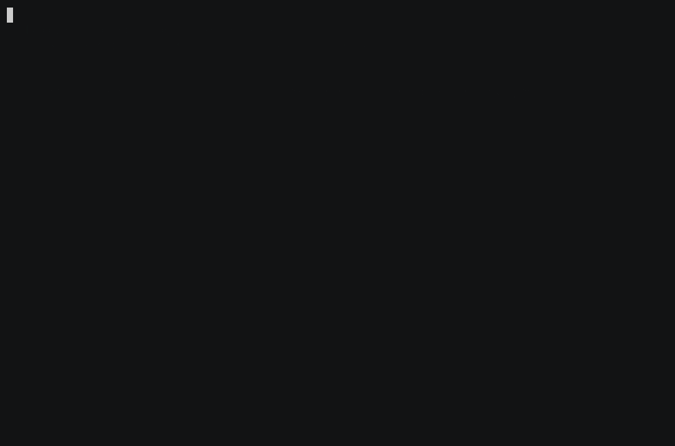

# BuddyNet

[](https://github.com/TZERO78/buddynet/actions/workflows/ci.yml)
[](https://github.com/TZERO78/buddynet/releases)
[](LICENSE)

> **A small, self-hosted peer-to-peer network for people and machines that trust
> each other.** One Linux binary, direct encrypted connections and your own
> coordination server — without an account, cloud dashboard or managed VPN
> provider.


BuddyNet connects machines across the internet, even when they are behind NAT.
The handshake server introduces two buddies and then steps out of the data path.
Whenever possible, traffic travels directly between them. If a direct path
cannot be established, BuddyNet can use your private, authorized relay as a
fallback.

BuddyNet is deliberately small. It is **not** a remote-desktop application, file
service or fleet-management platform. Run `ssh`, `rsync`, `borg`, SMB or another
service through the tunnel — BuddyNet only provides the private connection.

## What BuddyNet offers

- direct peer-to-peer connections with automatic NAT traversal;
- end-to-end encrypted tunnels using QUIC TLS 1.3 or optional WireGuard;
- a coordination server and optional private relay that you operate yourself;
- cryptographic identities and explicit peer trust instead of user accounts;
- several simultaneous buddy connections, local names and revocation;
- one binary for the `buddy`, `handshake` and `relay` roles;
- Linux amd64/arm64 and an Unraid plugin;
- no hosted service, subscription, web portal or telemetry backend.

The relay is **not an open relay**: although its UDP port may be publicly
reachable, it refuses to start without an authorization policy. It forwards
encrypted packets but cannot decrypt tunnel contents. Like every network
intermediary, the server can still observe operational metadata such as IP
addresses, timing and traffic volume.

## Who it is for

BuddyNet is optimized for controlled networks belonging to families, friends,
small teams and self-hosters. A handful of machines — often around 2 to 16 per
node — keeps operation and trust management simple. **That is a practical
orientation, not a security or functional limit.** Larger setups are possible,
but increase the work required for keys, approvals, monitoring and diagnosis.
The code enforces a hard safety ceiling of 48 peers per node.

BuddyNet does not try to replace Tailscale, NetBird or other mature platforms.
Those projects provide broader platform support, central administration,
commercial support and infrastructure at a much larger scale. Choose BuddyNet
when a transparent, self-operated and compact tool fits better than a managed
platform.

## What you need

- Linux on the participating machines;
- one machine reachable from the internet for the `handshake` role;
- optionally the `relay` role on the same or a separate machine;
- ownership of server updates, firewalling, keys and backups.

A small VPS is the usual choice — but **that machine may be one of the two
buddies**. If one of you has an always-on box behind a router you control, it can
run `--role=buddy,handshake,relay` and be coordinator and buddy in one process, so
nobody rents anything. A dynamic address is fine (DynDNS); the router has to
forward both UDP ports **and** allow NAT loopback. What that setup does and does
not cover is [step 0 of the setup guide](docs/SETUP.md#0-do-you-need-a-vps-at-all).

Or skip the server entirely: with **`--direct`** the two buddies talk to each
other and nothing else — you tell each side where its buddy is (a dynamic-DNS
name is fine) and pin its key, and that is the whole configuration. No
matchmaking, no token, no third party. See
[Direct mode](docs/SETUP.md#direct-mode-no-server-at-all).



Every key, `CONNECTED` line and response above comes from a real pair of
processes started by [`lab/demo-direct.sh`](lab/demo-direct.sh); the commands it
types are checked against the binary before recording, so it cannot show one that
does not run.

Either way the buddies themselves may sit behind ordinary NAT or CGNAT. Only the
reachable side has to be reachable — if *neither* of you is (real CGNAT on both
ends), you need a rented machine.

## Install

**You do not have to build anything.** Every release ships ready-to-run binaries
for Linux **amd64** and **arm64**. They are statically linked, so there is no
runtime, no glibc requirement and nothing to install alongside them — download,
make executable, run.

```bash
# pick your architecture: buddynet-linux-amd64 or buddynet-linux-arm64
curl -LO https://github.com/TZERO78/buddynet/releases/latest/download/buddynet-linux-amd64
curl -LO https://github.com/TZERO78/buddynet/releases/latest/download/buddynet-linux-amd64.sha256
sha256sum -c buddynet-linux-amd64.sha256

sudo install -m0755 buddynet-linux-amd64 /usr/local/bin/buddynet
buddynet --version
```

Before you put it on a public server, **verify the signature** as well — every
release is keyless-signed with cosign/Sigstore, and each artifact ships a
`.bundle` next to it. The exact command is in
[Setup — install the binary](docs/SETUP.md#2-install-the-binary-verified).

Each release also contains `buddynet-handshake-linux-{amd64,arm64}` — a separate,
single-purpose binary for running a **public** matchmaker — and an SPDX SBOM.

**Unraid users need none of this:** the [plugin](#unraid-plugin) downloads the
pinned release itself and refuses a binary whose checksum does not match.

**Linux only.** Windows and macOS builds were dropped in v3.0.1 and are not
planned. There is no published container image either — `deployments/docker-compose.yml`
builds locally from this repository, so Docker is the one path that does need a
checkout.

## Quickstart: two buddies and one VPS

For production, follow the hardened [setup guide](docs/SETUP.md). The commands
below show the basic flow.

### 1. Start the server

Create the server identity and relay ID once:

```bash
buddynet --role=handshake --key /var/lib/buddynet/id.key init
buddynet gen-relay-id
```

Back up the identity key, then start both server roles:

```bash
buddynet --role=handshake,relay \
  --key /var/lib/buddynet/id.key \
  --relay-endpoint vps.example:51821 \
  --relay-id RELAY_ID
```

Pin the displayed server key on every buddy with `--server-key`. The shipped
systemd unit and compose file run the private server in
[approval mode](docs/SETUP.md#approval-mode--recommended-for-a-private-server):
only keys you approved may pair, and until you approve one, nobody does.

### 2. Create an invite

On the first buddy, for example the machine running an rsync service:

```bash
buddynet --role=buddy \
  --server vps.example:51820 \
  --server-key SERVER_KEY \
  --invite \
  --forward 127.0.0.1:873
```

Transfer the invite over a trusted channel such as a phone call or Signal.
Treat it like a password: keep it out of shell history and logs.

### 3. Join from the second buddy

Store the invite in a file readable only by its owner and join:

```bash
chmod 600 invite.txt
export BUDDYNET_JOIN="$(<invite.txt)"

buddynet --role=buddy \
  --server vps.example:51820 \
  --server-key SERVER_KEY \
  -L 127.0.0.1:9000
```

On first contact the inviter asks once for the six-character code shown here —
read it out over the same trusted channel. Then ordinary tools can use the local
endpoint:

```bash
rsync -a /data/ rsync://localhost:9000/backup/
```

The tunnel prefers a direct P2P path. The authorized relay is used only when
direct connectivity fails.

## Several buddies

With a peers file, one node can maintain several tunnels at once. Each buddy is
pinned by key, can be addressed by a `.buddy` name and can be revoked locally:

```bash
buddynet --peers-file /var/lib/buddynet/peers peers list
buddynet --peers-file /var/lib/buddynet/peers peers add BUDDY_KEY shared-token --name alice
buddynet --peers-file /var/lib/buddynet/peers peers remove PEER
buddynet --peers-file /var/lib/buddynet/peers peers allow PEER
```


See [Operations — Many buddies](docs/OPERATIONS.md#many-buddies-multipeer) for
the manifest format, routing and revocation behaviour.

## Unraid plugin

BuddyNet is available as an Unraid plugin for the `buddy` role. It integrates
the service into **Tools → BuddyNet**, starts and stops it with the array, shows
connection status and traffic, and supports invites, pinned buddy identities,
revocation, BuddyDNS, lazy tunnels and optional WireGuard exposure. Identity
keys and trust data are kept in the Unraid appdata directory with restrictive
permissions rather than on the FAT-formatted flash drive.

A **Mode** selector picks how the two of you find each other:

- **Coordinator** (default) — a handshake server introduces you, and the plugin
  needs nothing from your router.
- **Direct** — [direct mode](docs/SETUP.md#direct-mode-no-server-at-all) with no
  server at all: fill in your buddy's address and pin their key. One of you must
  be reachable, so this is the one path that does need a forwarded UDP port. The
  buddy key is **required** here — without a server there is nothing else that
  authenticates your buddy, and the service refuses to start without it.

The plugin keeps the same small model as the command-line tool: it manages the
encrypted tunnel but does not become a backup or file-sharing service. You
choose and secure the software that runs through it. Installation, first
pairing and the Unraid-specific security behaviour are explained in the
**[BuddyNet Unraid plugin guide](unraid/BuddyNet/README.md)**.

## Security model

BuddyNet assumes that an attacker knows the source code. Security depends on
cryptographic keys and fresh secrets, never on hidden implementation details.

- buddies pin the server identity;
- invitations bind the expected peer identity;
- an interactive verification code or an explicit peer pin confirms trust;
- matchmaking is encrypted and signed;
- relay access requires a signed, short-lived ticket or an explicit network
  policy;
- replay protection, bounded state and rate limits protect the public server
  roles;
- WireGuard exposure is fail-closed unless ports are explicitly allowed.

BuddyNet protects the connection between uncompromised machines. It cannot
protect data after an endpoint, its identity key or the operating system has
been compromised. VPS hardening, SSH, host firewalls, updates, backups and
upstream DDoS protection remain operational responsibilities, not functions of
the tunnel protocol.

The complete trust model and its limits are documented in
[SECURITY.md](SECURITY.md). Security tests and the dated self-audit material are
published in [lab/pentest](lab/pentest/README.md). These are project-owned tests,
not an independent third-party certification; unknown defects may remain.

## Documentation

- **Start here:** [Setup](docs/SETUP.md) — VPS, pairing and hardening, in order ·
  [Unraid](unraid/BuddyNet/README.md)
- **Operate:** [Operations](docs/OPERATIONS.md) — many buddies, `.buddy` names,
  diagnosis, log schema · [WireGuard](docs/WIREGUARD.md)
- **Understand:** [Security model](SECURITY.md) ·
  [Architecture](docs/ARCHITECTURE.md) · [Protocol](docs/PROTOCOL.md)
- **Every flag:** `buddynet --help` — the authoritative list, always current

The README describes the normal path. Detailed protocol, security and unusual
deployment behaviour belongs in the linked documents so that each statement has
one authoritative home.

## Build from source

Only needed if you want to change something, review the code you run, or build a
container image — see [Install](#install) for the normal path.

```bash
go build -ldflags="-s -w" -o buddynet ./cmd/buddynet
go test ./...
```

Releases are built by [`release.yml`](.github/workflows/release.yml) from a
tagged commit, signed, and published with a SLSA build provenance attestation, so
a downloaded binary can be traced back to the workflow and commit that produced
it.

## License and project status

BuddyNet is MIT-licensed open-source software without an SLA, commercial support
or availability guarantee. Development is AI-assisted; the project owner remains
responsible for design, review, tests and releases.

See [LICENSE](LICENSE), [CHANGELOG.md](CHANGELOG.md) and
[CREDITS.md](CREDITS.md).
